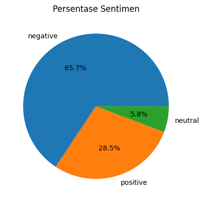
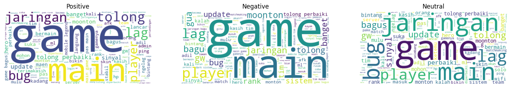

# Sentiment Analysis of Mobile Legends Reviews from Google Play Store

This project performs sentiment analysis on Mobile Legends user reviews scraped from the Google Play Store. It uses Natural Language Processing (NLP) techniques and a lexicon-based approach to classify sentiment into positive, negative, and neutral.

## Process
- Data scraping from Google Play Store
- Text preprocessing (case folding, tokenizing, stopword removal, normalization)
- Sentiment classification using lexicon-based method
- Visualization using pie chart and wordcloud

## Results

### Sentiment Distribution

### WordCloud

## Insights
The analysis shows that a significant portion of user reviews is dominated by negative sentiment, indicating overall dissatisfaction among players. Frequently occurring words such as "lag" and "jaringan" in the negative word cloud suggest that performance issues and network instability are the main concerns reported by users. 

Despite this, positive sentiment still appears in a notable portion of the reviews, with users highlighting aspects related to gameplay enjoyment and overall gaming experience. This indicates that while the core game is engaging, technical issues may be affecting user satisfaction.

Neutral reviews generally consist of descriptive or less opinionated statements, reflecting user feedback that does not strongly express positive or negative emotions.

## Dataset

The dataset is not included in this repository due to size limitations.  
To generate the dataset, run the following command:

python scraping.py

This script will scrape user reviews of Mobile Legends from the Google Play Store and save them into a CSV file for analysis.

## Tools
Python, Pandas, Matplotlib, NLTK, Sastrawi, WordCloud

## Author
Eko Hrn
